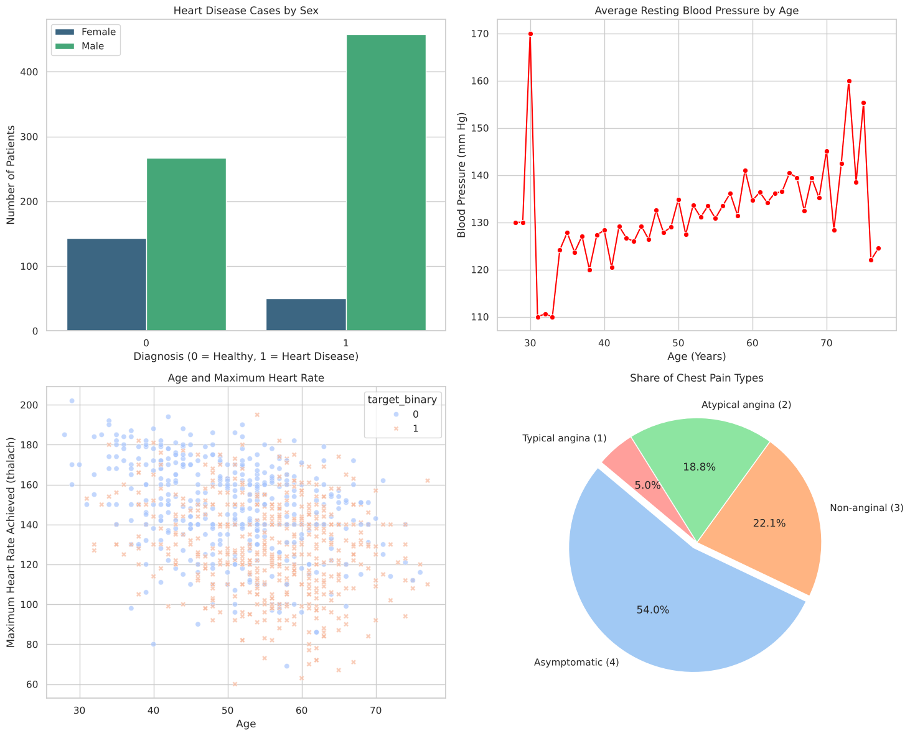
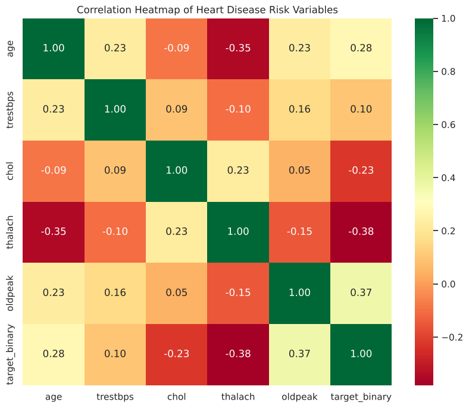
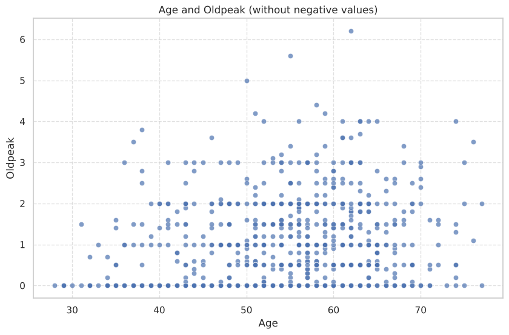
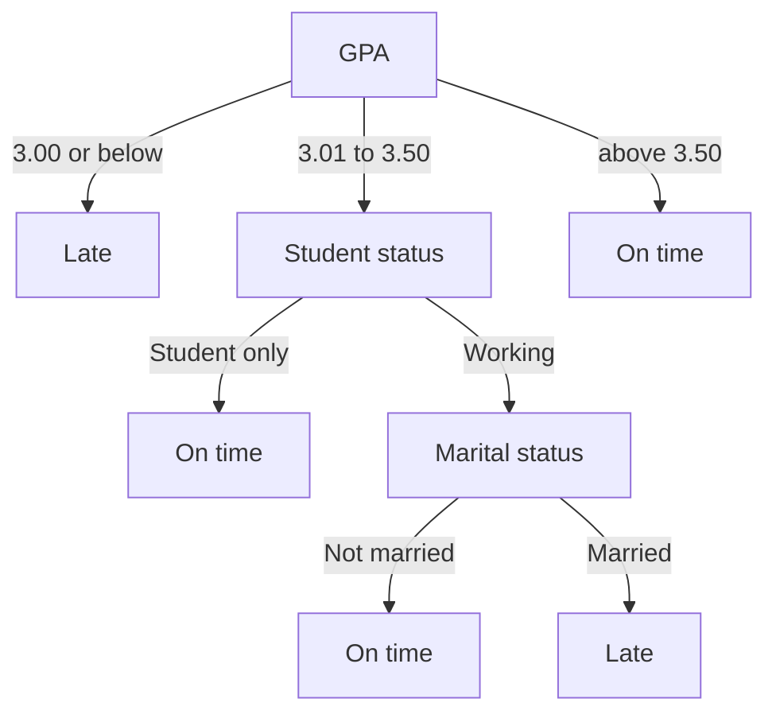

# Heart Disease Data Science

Group project for a Data Science course. We used the UCI Heart Disease dataset to practice the basic workflow: cleaning, exploration, descriptive statistics, probability, and a simple linear regression. The last part uses a small table of student graduation data to try a decision tree and a perceptron.

Notebook: [Heart_Disease_Data_Science.ipynb](Heart_Disease_Data_Science.ipynb) ([open in Colab](https://colab.research.google.com/github/Kireei/Heart-Disease-Data-Science/blob/main/Heart_Disease_Data_Science.ipynb))

## Contributions

This was a group project.

- **My part**: data exploration and model testing.
- **Teammates**: data cleaning, descriptive statistics, and building the decision trees and the perceptron.

## Dataset

Four processed files from the UCI Machine Learning Repository, combined into one table:

| File | Rows |
|---|---|
| Cleveland Clinic Foundation | 303 |
| Hungarian Institute of Cardiology | 294 |
| University Hospital, Switzerland | 123 |
| V.A. Medical Center, Long Beach | 200 |
| Total | 920 |

Cleaning:

- Removed 2 duplicate rows.
- Dropped `ca`, `slope`, and `thal`, which are each missing in more than 30% of the rows.
- Filled the other missing values with the median (numeric) or the mode (categorical).
- Grouped `target` (0 to 4) into `target_binary` (0 = no heart disease, 1 = heart disease).

This leaves 918 rows.

## What we found



- 508 of 918 patients (55.3%) have heart disease.
- Men are 79% of the data, so counts by sex are misleading. By rate, about 63% of the men have heart disease (458 of 725) and about 26% of the women (50 of 193).
- 54% of patients have chest pain type 4 (asymptomatic, meaning no chest pain). About 79% of them have heart disease (392 of 496).



- A lower maximum heart rate (`thalach`, -0.38) and a higher ST depression (`oldpeak`, 0.37) go with heart disease. Maximum heart rate also goes down with age (-0.35).



- Age alone does not predict `oldpeak`. The linear regression has an R-squared of 0.06, and its prediction only moves from 0.79 at age 50 to 1.05 at age 60.

### Decision tree and perceptron

This part uses a table of 15 students (gender, student status, marital status, GPA) to predict whether a student graduates on time.

Tree 1 only checks GPA (above 3.00 is on time). Tree 2 adds more checks for a GPA in the middle:



| Model | Correct on the 15 rows | Male, student only, not married, GPA 2.50 | Female, working, not married, GPA 2.50 |
|---|---|---|---|
| Tree 1 | 15 | Late | Late |
| Tree 2 | 13 | Late | Late |
| Perceptron | 10 | On time | Late |

What testing showed:

- Tree 2 is wrong on rows 5 and 13. Both students are working and married but graduated on time, so the "working and married = late" rule does not match the table.
- The perceptron says on time for 13 of the 15 rows and only finds 2 of the 7 late students. Guessing on time for everyone already gives 8 of 15.
- Tree 1 gets all 15 rows with GPA only, so the perceptron should be able to do the same. It stopped training after 7 epochs.

## Limitations

- `chol` has 172 zeros and `trestbps` has 1. They are probably missing values written as 0 and were not fixed, so the cholesterol statistics are too low.
- The regression is tested on the same rows it was trained on.
- The student table has only 15 rows. The perceptron stopped training early and GPA was not scaled, so its predictions are not reliable yet.

## How to run

```
pip install -r requirements.txt
jupyter notebook Heart_Disease_Data_Science.ipynb
```

## Data source

Janosi, A., Steinbrunn, W., Pfisterer, M., & Detrano, R. (1989). Heart Disease [Dataset]. UCI Machine Learning Repository. https://doi.org/10.24432/C52P4X

Licensed under CC BY 4.0. The principal investigators who collected the data:

- Hungarian Institute of Cardiology, Budapest: Andras Janosi, M.D.
- University Hospital, Zurich, Switzerland: William Steinbrunn, M.D.
- University Hospital, Basel, Switzerland: Matthias Pfisterer, M.D.
- V.A. Medical Center, Long Beach and Cleveland Clinic Foundation: Robert Detrano, M.D., Ph.D.
